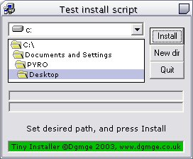



## Tiny Online Installer

### Description

*Updated* 07/01/2003

The installer was trying to make a shortcut, even if you didnt provide info for one, also ive changed it to compile into P-Code, making it compile to just over 50kb now ;D

I was in need of an installer similar to the one SmartFTP provided, downloading the install files from a HTTP server, i couldnt find one to match my needs, so i made one, and here it is.. :P

Its extremely simple, only took a few hours to make, thanks to Sean Gallardy for his brilliant http downloading control ;)

Comes complete with demo config file, compiles to just over 50KB, making it small, and easy to distribute over the net.

Please leave your comments, suggestions etc...it would be appriciated
 
### More Info
 

             |
---                |---
**Submitted On**   |2003-01-06 12:16:18
**By**             |[James Hooker](https://github.com/Planet-Source-Code/PSCIndex/blob/master/ByAuthor/james-hooker.md)
**Level**          |Advanced
**User Rating**    |5.0 (30 globes from 6 users)
**Compatibility**  |VB 6\.0
**Category**       |[Miscellaneous](https://github.com/Planet-Source-Code/PSCIndex/blob/master/ByCategory/miscellaneous__1-1.md)
**World**          |[Visual Basic](https://github.com/Planet-Source-Code/PSCIndex/blob/master/ByWorld/visual-basic.md)
**Archive File**   |[Tiny\_Onlin152539172003\.zip](https://github.com/Planet-Source-Code/james-hooker-tiny-online-installer__1-42223/archive/master.zip)

